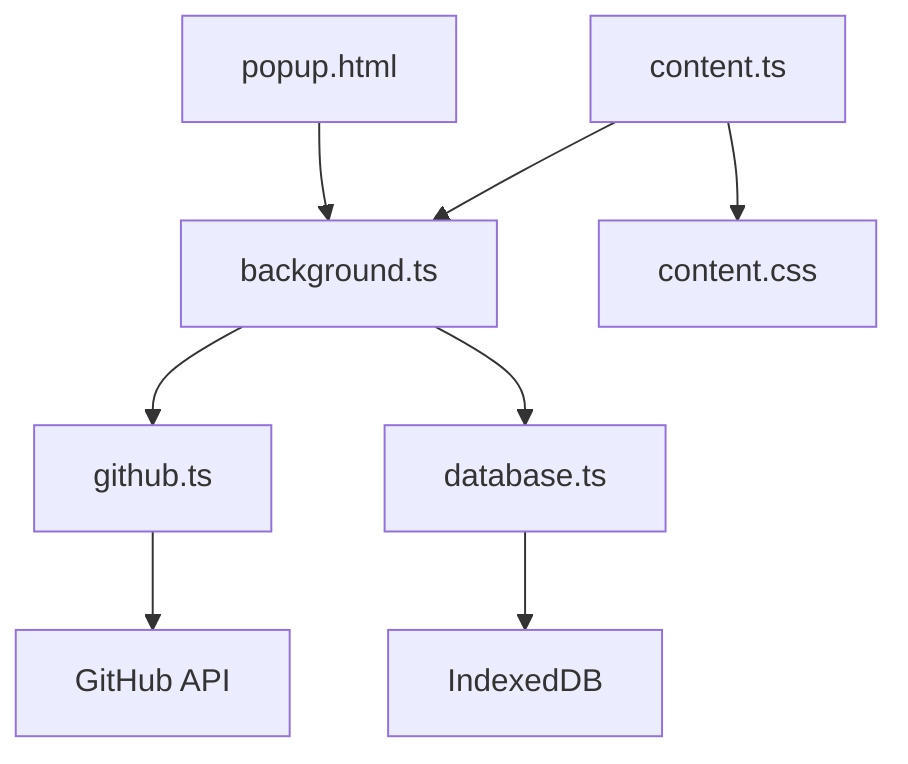

# 📊 AnimestarsCards Stats Extension

> Chrome расширение для отображения статистики карт прямо на страницах animestars.org

[](https://chrome.google.com/webstore)
[](https://github.com/hantYT/animestars-card-stats-ext/releases/latest)
[](https://www.typescriptlang.org/)
[](https://developer.chrome.com/docs/extensions/mv3/)
[](https://opensource.org/licenses/MIT)

## ✨ Возможности

- 📈 **Живая статистика** - отображение users/need/trade прямо на страницах карт
- 🔄 **Автообновление** - синхронизация с GitHub репозиторием баз данных
- 🎨 **Адаптивный дизайн** - умное масштабирование для разного количества данных
- 💾 **Локальное кэширование** - быстрая работа с IndexedDB
- 🌟 **Glassmorphism UI** - современный полупрозрачный интерфейс
- 🚀 **Высокая производительность** - оптимизировано для работы с большими базами

## 🎯 Что показывает расширение

На каждой странице карты отображается:
- 👥 **Users** - количество пользователей, у которых есть эта карта
- 💎 **Need** - количество пользователей, которым нужна эта карта  
- 🔄 **Trade** - количество пользователей, готовых обменять эту карту

## 📱 Скриншоты

### 🏠 Всплывающее окно
Статистика базы данных, последнее обновление, принудительная синхронизация

### 🎴 Статистика на странице карты
Элегантное отображение данных с адаптивным размером

### 📊 Компактный режим
Для карт с малым количеством взаимодействий

## 🛠 Установка

### 📦 Готовые релизы (Рекомендуется)

**Самый простой способ для пользователей:**

1. Перейдите на [страницу релизов](https://github.com/hantYT/animestars-card-stats-ext/releases)
2. Скачайте файл `animestars-card-stats-v{version}.zip` из последнего релиза
3. Распакуйте архив в любую папку
4. Откройте `chrome://extensions/` в Chrome
5. Включите "Режим разработчика" (Developer mode)
6. Нажмите "Загрузить распакованное расширение" (Load unpacked)
7. Выберите распакованную папку
8. Готово! Расширение установлено и готово к работе

### ⭐ Из Chrome Web Store
*Скоро будет доступно*

### 🔧 Ручная сборка для разработчиков

1. **Клонирование репозитория**
```bash
git clone https://github.com/hantYT/animestars-card-stats-ext.git
cd animestars-cards-extension
```

2. **Установка зависимостей**
```bash
npm install
```

3. **Сборка расширения**
```bash
npm run build
```

4. **Загрузка в Chrome**
   - Откройте `chrome://extensions/`
   - Включите "Режим разработчика"
   - Нажмите "Загрузить распакованное расширение"
   - Выберите папку `dist/`

## 🔧 Разработка

### Требования
- Node.js 16+
- npm или yarn
- Chrome/Chromium браузер

### Скрипты

```bash
# Разработка с hot reload
npm run dev

# Сборка для production
npm run build

# Сборка для production + создание архива (минимизация включена)
npm run build:prod

# Линтинг кода
npm run lint

# Автоисправление линтинга
npm run lint:fix

# Создание .zip для публикации
npm run package
```

### Структура проекта

```
src/
├── background.ts      # Service Worker (Manifest V3)
├── content.ts         # Content script для inject статистики
├── content.css        # Стили для статистики
├── database.ts        # IndexedDB wrapper
├── github.ts          # GitHub API интеграция
├── types.ts           # TypeScript типы
└── manifest.json      # Манифест расширения

icons/                 # Иконки расширения
popup.html            # HTML всплывающего окна
popup.js              # Логика всплывающего окна
```

### Архитектура



## 🔄 Как работает синхронизация

1. **Инициализация** - при первом запуске загружает последнюю базу с GitHub
2. **Периодическая проверка** - проверяет обновления каждые 30 минут
3. **Умное кэширование** - сохраняет данные локально для быстрого доступа
4. **Инкрементальные обновления** - загружает только изменения

### Источник данных
Расширение синхронизируется с [animestars_cards_datasets](https://github.com/hantYT/animestars_cards_datasets), который автоматически собирает данные с сайта.

## ⚡ Производительность

- **База данных**: 29,000+ карт
- **Размер в памяти**: ~5MB
- **Время загрузки**: <2 секунды
- **Отображение статистики**: <100ms

## 🎨 Дизайн-система

### Цвета
- **Основной**: `#1a1a1a` (темная тема)
- **Акцент**: `#4CAF50` (зеленый)
- **Текст**: `#ffffff` (белый)
- **Фон**: `rgba(255, 255, 255, 0.1)` (glassmorphism)

### Адаптивные размеры
```css
/* Маленькие значения (0-50) */
--stats-font-size: 0.9rem;
--stats-gap: 8px;

/* Средние значения (51-200) */
--stats-font-size: 1rem;
--stats-gap: 10px;

/* Большие значения (201+) */
--stats-font-size: 1.1rem;
--stats-gap: 12px;
```

## 🔒 Приватность и безопасность

- ✅ **Никаких персональных данных** - расширение не собирает личную информацию
- ✅ **Локальное хранение** - все данные хранятся в вашем браузере
- ✅ **Открытый исходный код** - весь код доступен для проверки
- ✅ **Минимальные разрешения** - запрашивает только необходимые разрешения

### Разрешения
- `storage` - для локального кэширования данных
- `https://animestars.org/*` - для работы на страницах сайта  
- `https://api.github.com/*` - для загрузки обновлений базы данных

## 🐛 Решение проблем

### Статистика не отображается
1. Проверьте что расширение включено
2. Обновите базу данных через всплывающее окно
3. Перезагрузите страницу карты

### Устаревшие данные
1. Откройте всплывающее окно расширения
2. Нажмите "Force Update"
3. Дождитесь завершения загрузки

### Медленная работа
1. Очистите кэш браузера
2. Перезапустите Chrome
3. Переустановите расширение

## 🛣 Roadmap

### v2.1.0 (Скоро)
- 🎯 **Фильтры карт** - поиск по рангу, автору, аниме
- 📊 **Расширенная статистика** - графики и тренды
- 🎨 **Темы оформления** - светлая/темная/цветные темы

### v2.2.0 (Планируется)
- 📱 **Мобильная оптимизация** - поддержка мобильного Chrome
- 🔔 **Уведомления** - алерты о новых картах
- 💾 **Экспорт данных** - сохранение статистики в файл

### v3.0.0 (Будущее)
- 🤖 **ИИ рекомендации** - умные советы по обмену
- 🌐 **Мультиязычность** - поддержка разных языков
- 🔗 **API интеграция** - прямое подключение к сайту

## 🤝 Вклад в развитие

Мы приветствуем любой вклад! Вот как можно помочь:

### 🐛 Баг-репорты
1. Проверьте [существующие issues](https://github.com/hantYT/animestars-card-stats-ext/issues)
2. Создайте новый issue с подробным описанием
3. Приложите скриншоты/логи если возможно

### 💡 Предложения функций
1. Откройте [GitHub Discussion](https://github.com/hantYT/animestars-card-stats-ext/discussions)
2. Опишите предлагаемую функцию
3. Объясните зачем она нужна

### 🔧 Pull Requests
1. Сделайте fork репозитория
2. Создайте feature branch (`git checkout -b feature/amazing-feature`)
3. Commit изменения (`git commit -m 'Add amazing feature'`)
4. Push в branch (`git push origin feature/amazing-feature`)
5. Откройте Pull Request

## 📄 Лицензия

Распространяется под лицензией MIT. См. [LICENSE](LICENSE) для подробностей.

## 📞 Поддержка

- 🐛 **Баги**: [GitHub Issues](https://github.com/hantYT/animestars-card-stats-ext/issues)
- 💬 **Обсуждение**: [GitHub Discussions](https://github.com/hantYT/animestars-card-stats-ext/discussions)
- 📦 **Релизы**: [GitHub Releases](https://github.com/hantYT/animestars-card-stats-ext/releases) - готовые сборки для установки

## 🚀 Быстрый старт

Хотите быстро попробовать расширение? 

1. **[Скачайте последний релиз](https://github.com/hantYT/animestars-card-stats-ext/releases/latest)** 📦
2. **Распакуйте архив** 📁
3. **Загрузите в Chrome** (`chrome://extensions/` → "Загрузить распакованное") 🔧
4. **Откройте animestars.org** и наслаждайтесь статистикой! 🎯

**Подробная инструкция**: [QUICKSTART.md](QUICKSTART.md)

## 🙏 Благодарности

- **animestars.org** - за замечательную платформу для коллекционирования карт
- **Chrome Extensions Team** - за отличную документацию Manifest V3  
- **TypeScript Team** - за мощный язык разработки
- **Сообщество пользователей** - за отзывы и предложения

---

⭐ **Поставьте звезду если расширение полезно!**

🔗 **Связанные проекты**:
- [animestars-carddata-grabber](https://github.com/hantYT/animestars-card-grabber) - Граббер для сбора данных карт